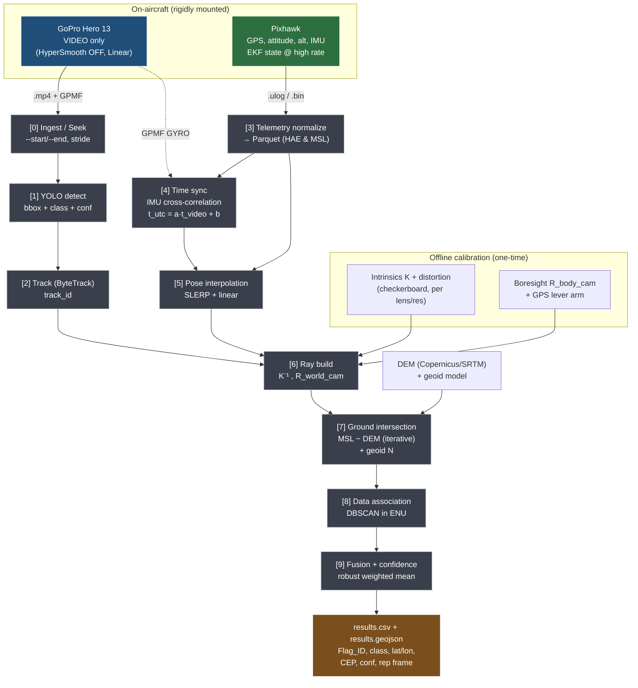

# UAV Flag Localization Pipeline — Architecture Design Review

**Author:** Senior UAV Navigation / CV / Localization review
**Date:** 2026-06-28
**Subject:** Critical review and redesign of the fixed-wing flag-geolocation pipeline (GoPro Hero 13 + Pixhawk)
**Status:** Recommended baseline for competition

---

## 0. Executive summary (read this first)

Your instinct to move telemetry to the Pixhawk is correct, but the proposed architecture is only **half** of what a competition-grade geolocation pipeline needs. The redesign below fixes four things that will otherwise dominate your error budget and make submission impossible:

1. **The projection model only works if the GoPro is treated as a rigid pinhole camera.** That forces three non-negotiable camera settings (HyperSmooth OFF, Horizon Lock OFF, Linear lens) and two calibrations you are almost certainly missing today: **camera intrinsics** and the **camera→IMU boresight extrinsic**. Without these, no amount of good telemetry will save you.
2. **"AGL as a constant input" is the wrong abstraction.** Localization does not need the height under the *aircraft*; it needs the height of the camera above the *ground point where the ray lands*. The correct quantity is `camera_MSL − terrain_elevation(target)`, resolved by intersecting the view ray with a terrain surface (flat plane or DEM). I also flag a classic **geoid-vs-ellipsoid (HAE vs MSL) trap** that silently injects 20–50 m of vertical error if ignored.
3. **38 detections ≠ 5 flags.** You need a *data-association + clustering* stage that collapses many raw detections into one result per physical flag, with a stable `Flag_ID`, a representative frame/timestamp, and a confidence. I specify the schema (CSV + GeoJSON) and the clustering algorithm.
4. **Time synchronization is the hidden error source.** At fixed-wing speeds, a 100 ms sync error is several metres on the ground. I recommend IMU cross-correlation sync (sub-frame) rather than relying on matching wall clocks.

Everything below is organized as the deliverables you asked for. Each major decision states *why*, because that rationale is what you'll defend in a design review.

---

## 0.4 Competition addendum (ICMTC 2026 UAVC-9 — supersedes specific items below)

After reading the official rules, several earlier recommendations were over-engineered or wrong for *this* competition. This section is authoritative; where it conflicts with Sections 2–7, **this wins**. Sources: the UAVC-9 rules PDF (Mission 1 "Rapid Assist", Annex A, Annex C, scoring tables).

**Hard facts that reshape the design:**

- **Targets are flat flags on the ground.** Annex C shows a 2 m × 1 m flag lying flat . There is **no pole**. → The anchor pixel is the **bbox centroid**, not the bottom edge. The pole-base logic in §2.2 is removed. (This is already what `detect.py` does — good.)
- **Accuracy tolerance is generous: 20 m for full points.** Flag-location scoring: 15 pts ≤20 m, 12 pts 20–30 m, 9 pts 30–40 m, 6 pts 40–50 m, 3 pts 50–60 m. → We need ~20 m CEP, not the 2–4 m the design chased. This single fact lets us drop the DEM, the boresight obsession, and complex covariance fusion. Aim for robust ≤20 m, not precision.
- **Flat desert airfield, 50–100 m AGL.** 6th-of-October desert airfield, flat. Targets and takeoff are on the same flat field. → **Flat-ground assumption is valid.** No DEM needed (see point 2 below).
- **The aircraft is autonomous with an autopilot + GCS.** The rules *mandate* live telemetry and submission of the **flight log** to the judges. → AGL, GPS, and attitude come from the **autopilot / control team**, not the GoPro. This is the real telemetry source (what §0.5 called "Phase B"). The GoPro GPMF is now backup only.
- **Mission 1 targets:** 2 flags inside the search area + 1 bonus flag outside the search area but inside the geofence = up to **3 flags** to geolocate. Search-area and geofence coordinates are given on the day → use them to label which detections are in-area vs the bonus.
- **Submission = GPS coordinates + target images on a USB drive**, handed in before leaving the GCS tent, within the mission/submission time window. → The output format is simple (coords + per-flag crop images), not a research-grade CSV. See point 4.

### Point 1 — Anchor (RESOLVED): use the flag centroid
Flags lie flat, so the bbox centre projects to the flag centre on the ground with no elevation offset. Keep `anchor = bbox center`. Remove the pole-base option. From an oblique view the centroid of a flat rectangle's bbox is a tiny bit biased, but far inside 20 m at 50–100 m AGL — ignore it.

### Point 2 — DEM is NOT needed; AGL comes from the control team
For a flat airfield at 20 m tolerance, the correct and simplest altitude is **AGL straight from the autopilot flight log** (barometric/relative-to-home, or rangefinder), combined with a **flat-ground plane**. The DEM iterative intersection (§3.3) and the geoid/HAE trap (§3.4) are **optional / not required here** — they only matter on sloped terrain or when mixing MSL and ellipsoidal altitudes, which we avoid by using AGL directly. Keep the flat-plane path as primary; keep `--alt` as a manual override for bench tests. (Questions to confirm with the control team are listed at the end of this section.)

### Point 3 — Clustering: keep it simple; DBSCAN over KMeans, and why
**What clustering is for here:** every frame that sees a flag produces one geolocated point, so one physical flag yields many points. Clustering = *deduplication by spatial proximity* — group the points of the same flag into one coordinate. It is **not** "discovering hidden groups."

**Why not KMeans:**
- KMeans needs **k (the number of clusters) up front.** You don't know it — could be 2, 3, or noisy. DBSCAN/threshold discover the count themselves.
- KMeans **forces every point into a cluster**, so a single false-positive detection drags a centroid off the real flag. DBSCAN labels sparse points as **noise (−1)** and discards them — exactly what you want.
- KMeans assumes round, balanced clusters; GPS scatter + outliers break that.

**Practical recommendation:** the flags are tens of metres apart and the tolerance is 20 m, so a **simple "group all detections within X metres" threshold** (your current greedy clustering) is entirely sufficient. DBSCAN is just a robust, off-the-shelf version of the same idea (`eps` ≈ your single-point spread, `min_samples` ≈ 3 to kill one-off false positives). Use whichever you understand best; **do not use KMeans.**

### Point 4 — Output: match the USB submission, plus the two-stage classifier
The judges want **coordinates + an image per identified flag**. So the output is:

```
submission/
  targets.csv          # Flag_ID, Identity, Latitude, Longitude, In_Search_Area(yes/no/bonus)
  flags/
    FLAG_01.jpg        # cropped close-up of the flag (best frame) — the USB evidence
    FLAG_01_context.jpg# (optional) full frame with bbox, proves where it was seen
    FLAG_02.jpg ...
debug/                 # team-only, NOT submitted
  all_detections.csv   # every detection + per-frame geolocation (for tuning)
  results_full.csv     # n_detections, mean_conf, frame, timestamp, CEP (your ranking)
```

`targets.csv` stays minimal — only what the judge needs. Keep the rich fields in `debug/` for your own ranking and debugging.

**Two-stage detect → classify (your teammate's idea — adopt it):**
1. **Detector** (current YOLO): coarse `flag / not-flag`, gives the bbox.
2. **Crop** the bbox from the original frame.
3. **Fine-grained classifier** on the close-up crop → the flag's **identity** (e.g. which national flag, the ~100-class model). This produces the "identification" the rules score (10 pts), and is far more reliable on a clean close-up than asking the detector to classify 100 classes at altitude.

Elegant bonus: **the crop you feed the classifier is the same image you save for the USB submission** — one artifact serves both. Pick the representative crop = the largest/sharpest/highest-confidence detection in the cluster (closest pass, biggest flag in pixels).

> Open question for the **judges** (not the control team): does "identify" mean "confirm it is a flag" or "name the country"? If the former, the classifier is optional; if the latter, the two-stage classifier is essential. Confirm before investing in the 100-class model.

### Questions to ask the control team (telemetry / autopilot)
1. Does the autopilot log **GPS lat/lon, altitude, and full attitude (roll, pitch, and especially yaw/heading)** with timestamps, and at what rates? (We need true heading, not GPS course-over-ground.)
2. Is **AGL** available directly (downward rangefinder/lidar) or only **barometric altitude relative to home/takeoff**? What is its reference point?
3. Altitude datum: relative-to-home, **AMSL**, or ellipsoidal (HAE)?
4. **Time sync:** how do we align the flight-log clock to the GoPro video? Is there a **GPS/UTC timestamp** in the log? Can we mark a synchronizable event (note the takeoff instant, or a visible manoeuvre/LED)?
5. Autopilot firmware & log format (**ArduPilot `.bin` / PX4 `.ulog`**)? Can we get the log file **immediately after the flight**, within the submission time window?
6. **GPS quality:** standard GPS or **RTK/DGPS**? Expected horizontal accuracy? (This sets our absolute-accuracy floor.)
7. **Camera mounting:** is the GoPro **rigidly fixed** to the airframe, and at what angle (nadir or tilted)? Does it move/gimbal? (Needed to relate image to attitude.)
8. Will the GCS give us the **geofence, search-area, and waypoint coordinates digitally** so we can auto-label in-area vs bonus flags?
9. Is the search area **flat relative to takeoff** (any metres of elevation difference)? (Confirms the flat-ground assumption.)

---

## 0.5 Implementation status & phased migration (reconciling design vs. current code)

**Important:** the *target* architecture in this document assumes a Pixhawk. The **current codebase is GoPro-only** — telemetry (GPS9 position + GRAV gravity vector) is parsed straight from the MP4's GPMF track, and because that metadata shares the video's clock, the detections and telemetry are already on one timeline. The Pixhawk is a *future* upgrade you're evaluating, not something installed today. This section reconciles the two so the design is honest about where you are.

**Consequence for time sync.** With GoPro-only, the hard time-sync problem (Section 1.3) **does not exist** — frames and telemetry come from the same device and clock, so the join is a direct interpolation by timestamp (this is exactly what `sync.py` does). The IMU cross-correlation method becomes necessary only in **Phase B**, when a Pixhawk introduces a second, independent clock. Read Section 1.3 as Phase-B design, not a present requirement.

**Consequence for attitude.** GoPro-only gives you *tilt* (roll/pitch) from the GRAV vector but **no true yaw** — the current code substitutes GPS course-over-ground (or a fixed `--heading`). That is the single biggest accuracy limit today (see overlooked issue #6) and is the main thing Pixhawk fixes.

### Phased roadmap

| Phase | Telemetry source | Sync | Attitude | What it buys |
|---|---|---|---|---|
| **A — now (harden GoPro-only)** | GoPro GPMF (GPS9, GRAV) | Shared clock, trivial | Tilt from GRAV; yaw from COG/fixed | Real calibration, AGL/DEM, anchor-pixel, DBSCAN + submittable output, time windowing. Targets the ~20 m competition spec. |
| **B — later (add Pixhawk)** | Pixhawk EKF (primary); GoPro = video + backup + sync gyro | IMU cross-correlation | True roll/pitch/**yaw** from EKF | Real heading (fixes crab error), cleaner altitude, boresight extrinsic → pushes toward few-metre CEP. |

The code is being refactored so the telemetry source sits behind a small provider interface (Stage 6), so Phase B is a drop-in swap rather than a rewrite.

### Design item → current code → stage that closes the gap

| Design item (this doc) | Current code | Action |
|---|---|---|
| Pixhawk authoritative state | GoPro GPMF only | Phase B (provider abstraction = Stage 6) |
| IMU cross-correlation sync (§1.3) | Shared clock, direct interp (`sync.py`) | Not needed until Phase B |
| Calibrated intrinsics (§7.1) | `calibrate_camera.py` writes `camera_matrix`/`dist_coeffs`; `localization.py` reads `K`/`dist` → **mismatch**, config empty | **Stage 1** (fix loader) |
| Anchor = bbox **centroid** (flat flags, §0.4) | bbox **center** in `detect.py` — already correct | No change needed |
| MSL − DEM altitude (§3) | `--alt` constant above flag | Stage 4 |
| DBSCAN + rich output (§5) | greedy 25 m cluster → `results.json` (no frame/timestamp/CEP/class/GeoJSON) | Stage 5 |
| start/end windowing (§4) | whole video, frame stride only | Stage 2 |
| Boresight extrinsic (§7.2) | none (camera assumed = body) | Phase B |

Everything in Sections 1–7 below describes the **target**; treat the Pixhawk-specific parts as Phase B and the rest as the Phase-A hardening the code is being updated toward.

---

## 1. Redesigned high-level architecture

### 1.1 Is the proposed architecture correct?

Partially. The data-source split (GoPro = pixels, Pixhawk = state) is right and is exactly what professional aerial-survey systems do. What's missing from the proposal:

- No **calibration** stage (intrinsics + boresight + lever arm). This is the difference between 3 m and 30 m accuracy.
- Time sync is described as a requirement but no **mechanism** is specified. "They must be synchronized" is not a design.
- No **terrain / altitude resolution** stage — the AGL problem (Problem 2) is unaddressed.
- No **data association / clustering** stage — the output problem (Problem 3) is unaddressed.
- Telemetry is treated as "use Pixhawk, ignore GoPro," which throws away GoPro's IMU stream that is the *easiest* way to solve time sync.

### 1.2 Source-of-truth table (which data comes from where)

| Quantity | Primary source | Backup source | Why |
|---|---|---|---|
| Video frames | **GoPro Hero 13** | — | Only the GoPro produces imagery. |
| Frame capture time | GoPro frame PTS + GPMF | Pixhawk via sync model | Each frame must map to a precise instant in the Pixhawk timeline. |
| Position (lat/lon) | **Pixhawk EKF** (`GLOBAL_POSITION_INT`) | GoPro GPS (GPMF GPS5/GPS9) | Pixhawk fuses GPS+IMU+baro; cleaner, higher rate, less jitter than the GoPro's standalone GPS. |
| Altitude (MSL/HAE) | **Pixhawk** (GPS+baro fused) | GoPro GPS altitude | See Problem 2. GoPro altitude is single-sensor and noisy. |
| Attitude roll/pitch/yaw | **Pixhawk EKF** (`ATTITUDE`) | GoPro CORI quaternion (only if stabilization OFF) | Pixhawk attitude is referenced to the airframe (FRD body frame), which is what the projection needs. GoPro CORI is camera-referenced and only valid with EIS off. |
| AGL (height above ground straight down) | Pixhawk rangefinder/lidar if fitted, else baro-relative | DEM lookup | Used as a sanity check and for the flat-ground fallback. |
| IMU rates (for time sync) | **Both** GoPro GPMF (GYRO/ACCL) and Pixhawk | — | Cross-correlating the two angular-rate streams recovers the time offset to sub-frame precision. |

**Bottom line on GoPro telemetry: do NOT ignore it — demote it to (a) backup state and (b) the time-sync reference.** Its GPS is a fallback if the Pixhawk log has a gap, and its gyro stream is the cheapest reliable way to align the two clocks.

### 1.3 What must be synchronized

Three clocks exist: the GoPro video PTS, the GoPro GPMF GPS/UTC time, and the Pixhawk log time (boot-time microseconds, plus GPS week/ms). Synchronization means recovering a single affine map

```
t_pixhawk = a · t_video + b      (a ≈ 1 corrects clock drift, b is the offset)
```

so that for any detection at video time `t_video` you can interpolate the Pixhawk pose at the exact capture instant. Recommended method, in order of preference:

1. **IMU cross-correlation (best, sub-frame).** Take GoPro GPMF gyro magnitude and Pixhawk gyro/attitude-rate magnitude over a window with deliberate motion (a few wing-rocks right after launch). Cross-correlate to find `b`; fit `a` over the whole flight. Sub-10 ms achievable.
2. **GPS-UTC matching (good, ~0.1 s).** Both devices stamp GPS/UTC. Align on common UTC. Limited by GoPro GPS rate (~10 Hz/18 Hz) and any internal latency.
3. **Visual event (fallback).** A bright LED flash or a sharp manoeuvre visible in both the image and the Pixhawk log gives a single anchor for `b`.

Do all three if you can; use #1 as truth and the others as cross-checks.

### 1.4 File formats exchanged between modules

Keep every interface a **plain, inspectable file** so each stage can be unit-tested in isolation (this also serves Problem 4 — you can re-run one stage on a time window without touching the others).

| Interface | Format | Notes |
|---|---|---|
| Raw telemetry in | `.ulog` (PX4) or `.bin` (ArduPilot) | Native flight log. |
| Normalized telemetry | **Parquet** (or CSV) | Columns: `t_utc, lat, lon, alt_hae, alt_msl, agl, roll, pitch, yaw, q_w,q_x,q_y,q_z, vN,vE,vD, gps_fix, num_sat`. One tidy table resampled/indexed by time. |
| Calibration | **YAML/JSON** | `K` (3×3), distortion coeffs, image size, lens mode, `R_body_cam` (boresight quaternion), `t_body_cam` (lever arm), GPS-antenna→camera offset. |
| Detections | **JSONL** (one line per detection) | `frame_idx, t_video, t_utc, class, conf, bbox_xyxy, anchor_px(u,v), track_id`. |
| Per-detection geolocations | **JSONL / Parquet** | adds `lat, lon, alt, slant_range, offnadir_deg, cov_2x2 (or CEP), gdop_flag`. |
| Final results | **CSV + GeoJSON** | Submission format (Section 5). |
| Config / run manifest | **YAML** | start/end time, fps subsample, model weights, paths, git hash — for reproducibility. |

### 1.5 Final pipeline (high level)

```
                ┌─────────────────────────────────────────────────────────┐
                │                   OFFLINE CALIBRATION                    │
                │   intrinsics (checkerboard)   +   boresight R_body_cam   │
                └─────────────────────────────────────────────────────────┘
                                          │ calib.yaml
                                          ▼
 GoPro .mp4 ─► [0] Ingest/Seek ─► frames ─► [1] YOLO Detect ─► [2] Track (ByteTrack)
                     │  (start/end window)                              │ tracklets+detections
                     ▼                                                  ▼
 Pixhawk .ulog ─► [3] Telemetry Normalize ─► [4] Time Sync ─► [5] Pose Interpolation (SLERP)
                                                                        │ pose @ each frame
                                                                        ▼
                                               [6] Ray Build (K⁻¹, R_world_cam)
                                                                        │ ray + camera pos
                                                                        ▼
                                  [7] Ground Intersection  ◄── DEM / flat-plane + geoid N
                                                                        │ per-detection lat/lon + cov
                                                                        ▼
                                  [8] Data Association + Spatial Clustering (DBSCAN)
                                                                        │ one cluster per flag
                                                                        ▼
                                  [9] Fusion (robust weighted mean) + Confidence
                                                                        │
                                                                        ▼
                                          results.csv  +  results.geojson
```

The full professional diagram (with frames and error annotations) is in `architecture_diagram.svg`, and the editable Mermaid source is in Section 10.

---

## 2. Detailed localization pipeline & recommended algorithms

This is the core. Define the frames once, then the math is mechanical.

### 2.1 Coordinate frames (define these or you will lose days to sign bugs)

- **World / local tangent:** ENU (East-North-Up) anchored at a reference lat/lon/alt. (NED is equally valid — pick one and never mix.)
- **Body (FRD):** Forward-Right-Down, the Pixhawk convention. Pixhawk roll/pitch/yaw rotate body→world.
- **Camera optical:** `x` right, `y` down, `z` forward (out of the lens). OpenCV convention.
- **Image:** pixels `(u,v)`, origin top-left.

The fixed rotation from camera to body is the **boresight** `R_body_cam` (from calibration). The full chain is:

```
R_world_cam = R_world_body(roll,pitch,yaw) · R_body_cam
```

### 2.2 Stage-by-stage

**[0] Ingest / Seek.** Open the mp4, seek to `start`, decode to `end` (Problem 4). Optionally subsample (every Nth frame). Output: frames + `(frame_idx, t_video)`.
*Algorithm:* keyframe-accurate seek (`ffmpeg -ss` before input for fast seek, then fine decode; or OpenCV `CAP_PROP_POS_MSEC`).

**[1] Detection.** YOLO (v8/v11) on each frame. Output bbox + class + conf.
*Anchor pixel:* **use the bbox centroid** — the competition flags lie flat on the ground (no pole), so the centroid projects to the flag centre with no elevation offset. (Superseded detail: see §0.4 Point 1. The pole-base option is removed.)

**[2] Tracking.** ByteTrack or OC-SORT to assign `track_id` across frames. This gives temporal association *for free* and is the first half of "which detection is which flag."

**[3] Telemetry normalize.** Parse `.ulog`/`.bin` → tidy table (Section 1.4). Convert quaternions to a consistent attitude representation. Record both `alt_hae` (ellipsoidal, from GPS) and `alt_msl` (orthometric).

**[4] Time sync.** Estimate `(a,b)` by IMU cross-correlation (Section 1.3). Output: a function `t_utc = f(t_video)`.

**[5] Pose interpolation.** For each frame's `t_utc`, interpolate position **linearly** and attitude with **SLERP** (quaternion spherical interpolation — never lerp Euler angles across wraps). Output: `(lat,lon,alt, q_world_body)` per frame.

**[6] Ray build.** Back-project the anchor pixel to a unit ray in the camera frame, then rotate to world:

```
d_cam   = K⁻¹ · [u, v, 1]ᵀ           (then undistort if not using Linear lens)
d_world = R_world_cam · d_cam,   normalized
```

**[7] Ground intersection.** Camera centre `C` (from GPS+alt, with lever-arm correction). Intersect the ray `P(s) = C + s·d_world` with the terrain (Section 3). Output: target `(lat,lon,alt)` + a covariance from propagating attitude/altitude/pixel uncertainty.

**[8] Data association + clustering.** Project every per-detection point to local ENU metres and run **DBSCAN** (`eps ≈ 3–5 m`, `min_samples ≈ 3`). Each cluster = one physical flag. Tracks help seed/merge but DBSCAN on world coordinates is what makes you robust to track fragmentation and to the same flag seen on two passes. (Section 5.)

**[9] Fusion + confidence.** Within each cluster, reject outliers (RANSAC / MAD), then fuse by **inverse-variance-weighted mean** (down-weight high-obliquity, low-confidence detections). Compute a confidence score (Section 5.3). Pick the representative frame = the detection with the lowest covariance (most nadir, highest conf).

### 2.3 The projection math (so you can reproduce it)

Pixel → unit ray (camera frame):
```
[x_c, y_c, z_c]ᵀ = K⁻¹ [u, v, 1]ᵀ,   d_cam = normalize([x_c, y_c, z_c])
```
Ray to world and intersect a flat ground plane at height `h_ground` (Up = const). With camera up-coordinate `C_u` and ray up-component `d_u` (negative when looking down):
```
s* = (h_ground − C_u) / d_u          # scalar distance along ray to the plane
P_world = C + s* · d_world
```
Convert `P_world` (ENU) back to lat/lon via the inverse local-tangent transform. The DEM version replaces the single plane with an iterative intersection (Section 3.3).

### 2.4 Recommended algorithm per stage (summary)

| Stage | Recommended | Alternatives |
|---|---|---|
| Detection | YOLOv8/v11 | RT-DETR |
| Tracking | ByteTrack | OC-SORT, SORT |
| Time sync | IMU gyro cross-correlation | GPS-UTC match |
| Pose interp | SLERP + linear | GP/B-spline on SE(3) |
| Intersection | Iterative DEM ray-march | flat plane (fallback) |
| Clustering | DBSCAN (metric ENU) | agglomerative, mean-shift |
| Fusion | Inverse-variance weighted mean + RANSAC | robust median, factor-graph |

---

## 3. The AGL / altitude problem (Problem 2)

> **Competition note (see §0.4 Point 2):** for this flat desert airfield at 20 m tolerance, the practical answer is simpler than this section's general treatment — use **AGL from the autopilot flight log + a flat-ground plane**, and skip the DEM and geoid steps. The material below is the general/rigorous version, kept for understanding and for any future non-flat site.

### 3.1 Restating the real question

Localization does **not** need AGL-under-the-aircraft. It needs the **camera height above the specific ground point the ray hits**. If terrain were perfectly flat and you knew its elevation, AGL-under-aircraft would equal that height. It usually isn't, and "AGL as a constant input" is wrong for two reasons: (a) AGL changes through the flight, and (b) even at one instant, the ground under the *target* may be higher or lower than the ground under the *aircraft*.

The geometrically correct height is:

```
H_target = camera_MSL_altitude − terrain_MSL_elevation(target_lat, target_lon)
```

### 3.2 Answering your specific questions

- **Should it use AGL?** Not as a constant. AGL straight-down (from a rangefinder) is useful as a *flat-ground fallback* and as a sanity check, but it is not the quantity the projection needs for off-nadir targets on non-flat terrain.
- **Should it use MSL?** Yes — camera **MSL altitude** is the right vertical reference, combined with terrain elevation. But beware the datum trap (Section 3.4).
- **Can AGL be estimated by Pixhawk?** Yes, three ways: (1) baro relative-altitude (drifts, only relative to the takeoff/arming point), (2) GPS/EKF MSL minus a known ground elevation, (3) a downward rangefinder/lidar gives true AGL but **only directly beneath the aircraft** and only to ~40–100 m range. None of these directly gives the height above an *off-nadir* target on sloped ground.
- **Should terrain (DEM) be used?** Yes for the desert with dunes/wadis. A DEM (Copernicus GLO-30 or SRTM 1-arc-sec, ~30 m posting; or a local survey/photogrammetry DEM if you can make one) lets you intersect the ray with the real surface. This is the single biggest accuracy lever after attitude calibration.
- **When is Relative Altitude sufficient?** When the terrain is genuinely flat (a dry lakebed/playa) **and** the target ground elevation ≈ takeoff elevation **and** you only need a few metres of accuracy. On a flat playa the flat-plane model with `h_ground = mean field elevation` is often within your error budget and is far simpler.
- **Best solution for fixed-wing over desert:** A **two-tier** approach. Default to **MSL altitude + DEM iterative ray intersection** (with geoid correction). Provide a **flat-plane fallback** (mean field elevation, or rangefinder AGL at the relevant time) for when the DEM is missing or the terrain is locally flat. Always fuse multiple detections so per-frame altitude noise averages out.

### 3.3 DEM iterative intersection (the algorithm)

The intersection point depends on terrain height, but terrain height depends on the (unknown) intersection point — so iterate:

```
1. h0 = mean field elevation (or terrain under aircraft)
2. intersect ray with plane at h0 → P0 = (lat0, lon0)
3. h1 = DEM(lat0, lon0)
4. intersect ray with plane at h1 → P1
5. repeat until |P_k − P_{k−1}| < 0.5 m  (3–5 iterations typical)
```

This converges quickly because desert slopes are gentle and the geometry is well-conditioned near nadir.

### 3.4 The datum trap (overlooked, costs 20–50 m if ignored)

GPS reports **ellipsoidal height (HAE)** above WGS-84. DEMs and "MSL" are **orthometric height** above the geoid. They differ by the **geoid undulation `N`** (in many regions tens of metres). You must convert consistently:

```
H_orthometric = H_ellipsoidal − N(lat, lon)        # EGM96/EGM2008 geoid model
```

Either bring the GPS altitude into the DEM's datum, or vice versa — but do it once, explicitly, and write a unit test with a known point. Mixing HAE and MSL is the most common silent altitude bug in amateur geolocation pipelines.

### 3.5 Mathematical implications on accuracy

Let `θ` be the off-nadir angle of the ray, `H` the camera height above the target, slant range `R = H / cos θ`.

**Altitude error → horizontal error.** Holding the ray direction fixed, a height error `ΔH` moves the intersection along the ground by
```
Δd_alt ≈ ΔH · tan θ
```
At nadir (`θ→0`) altitude error contributes ~0 horizontal error. At `θ = 30°`, `tan θ ≈ 0.58`, so 5 m of altitude error → ~2.9 m horizontal. At `θ = 45°`, it's 1:1. **Conclusion: keep targets near nadir; obliquity amplifies every altitude error.**

**Attitude error → horizontal error.** An angular error `Δφ` in the ray direction moves the landing point by
```
Δd_att ≈ R · Δφ / cos θ = H · Δφ / cos²θ
```
At `H = 100 m`, `θ = 30°`: `Δd_att ≈ 100 · Δφ / 0.75`. For `Δφ = 1° = 0.0175 rad`, that's ≈ **2.3 m per degree** of attitude/boresight error. This term exists even at nadir (`≈ H·Δφ`) and usually **dominates the budget** — which is exactly why boresight calibration and stabilization-off matter more than altitude.

**Example error budget (H=100 m, θ=20°):**

| Source | Assumed σ | Horizontal σ |
|---|---|---|
| Attitude (EKF) | 0.5° | ~0.9 m |
| Boresight calib | 0.5° | ~0.9 m |
| Altitude (MSL+DEM) | 3 m | ~1.1 m |
| GPS horizontal | 1.5 m | 1.5 m |
| Time sync (10 ms @ 25 m/s) | 0.25 m | 0.25 m |
| Pixel/anchor (2 px) | — | ~0.3 m |
| **RSS total (1 detection)** | | **≈ 2.4 m** |

Fusing `N` independent detections shrinks the random part by ~`1/√N` (the GPS/boresight biases don't average out, so they set the floor). With 8–10 detections per flag you should reach **2–4 m CEP**, competitive for most rules.

---

## 4. Performance — start/end time windowing (Problem 4)

### 4.1 Design

Add a time window to the run manifest / CLI:

```
--start 00:03:10  --end 00:05:40   [--fps-stride 2]   [--roi ...]
```

Accept both `HH:MM:SS(.ms)` and raw seconds. Convert to a `[t0, t1]` interval up front and pass it to every stage.

### 4.2 Which modules change (and which don't)

| Module | Change | Why |
|---|---|---|
| **[0] Ingest/Seek** | **Seek** to `t0`, stop at `t1`; optional frame stride | Decoding only the window is the actual speedup. Do NOT decode-then-skip — seek so you never touch frames outside the window. |
| **[3] Telemetry normalize** | Load only `[t0 − margin, t1 + margin]` | Margin (≈1 s) preserves interpolation at the edges. Saves memory. |
| **[4] Time sync** | Estimate on full flight (or a sync window), then apply | Sync should use the rich-motion launch segment; don't tie it to the processing window. |
| **[1][2][6][7][8][9]** | **No logic change** | They operate only on the frames they receive. This is the payoff of clean file interfaces. |

### 4.3 Extra speedups (cheap wins)

Frame stride (process every 2nd–3rd frame — you have far more detections than you need after clustering); batched GPU inference; restrict YOLO to the relevant class; cache the normalized telemetry Parquet so re-runs skip parsing; run stages [1]/[3] in parallel (independent inputs). Seeking + stride alone typically turns a full-video run into seconds-per-minute-of-window.

---

## 5. Redesigned output format (Problem 3)

> **Competition note (see §0.4 Points 3 & 4):** the *submission* format is the simple one in §0.4 — `targets.csv` (Flag_ID, identity, lat, lon, in-area flag) plus a `flags/` folder of per-flag crop images for the USB drive. The detailed CSV/CEP schema below is kept for your **own `debug/` use and ranking**, not for the judges. Clustering stays simple (greedy threshold or DBSCAN; **not KMeans** — see §0.4 Point 3). Add the two-stage detect→classify step for flag identity.

### 5.1 Why 38 → 5 is a clustering problem

Every frame that sees a flag produces one detection, each detection produces one geolocated point. 38 raw points for 5 flags is expected. The job is **data association**: decide which points are the *same physical flag*, collapse each group to one row.

Three complementary signals:

- **Temporal / tracking:** consecutive frames of the same flag share a `track_id` (ByteTrack). Great while the flag stays in view; breaks on occlusion, re-entry, or a second pass.
- **Spatial clustering:** geolocated points of one flag fall within a few metres in world coordinates regardless of track. **DBSCAN in ENU metres** is the workhorse — it needs no preset cluster count (you don't know it's 5 ahead of time), handles noise, and merges fragmented tracks and multi-pass sightings.
- **Class consistency:** cluster within a class so a "flag" and a "not-flag" never merge.

**Recommended:** tracker for per-frame association → geolocate every detection → **DBSCAN on (E,N)** with `eps≈3–5 m`, `min_samples≈3` → each cluster is one flag → robust weighted fusion. This hybrid is robust to both track breaks and GPS jitter.

### 5.2 Submission schema

**`results.csv`** — one row per physical flag:

```
Flag_ID, Flag_Class, Detection_Count, First_Seen_UTC, Last_Seen_UTC,
Representative_Frame, Representative_Timestamp_UTC,
Latitude, Longitude, Altitude_MSL_m,
CEP50_m, Cov_EE, Cov_EN, Cov_NN,
Mean_OffNadir_deg, Localization_Confidence, Notes
```

| Field | Meaning |
|---|---|
| `Flag_ID` | Stable ID, e.g. `FLAG_001`. |
| `Flag_Class` | `flag` / `not_flag` (your two classes). |
| `Detection_Count` | Cluster size (used in confidence). |
| `Representative_Frame/Timestamp` | The single best detection (lowest covariance) — lets judges verify against the video. |
| `Latitude/Longitude` | Fused WGS-84 coordinate. |
| `CEP50_m` | Circular error probable — the headline accuracy number. |
| `Cov_*` | 2×2 ENU covariance for full uncertainty. |
| `Mean_OffNadir_deg` | Geometry quality indicator. |
| `Localization_Confidence` | 0–1 (Section 5.3). |

Also emit **`results.geojson`** (Point features with the same properties) so you can drop it on a map and eyeball it instantly — the fastest debugging tool you have.

### 5.3 Confidence score

Combine the signals that actually predict accuracy:

```
confidence = w1·mean_detection_conf
           + w2·f(Detection_Count)          # saturating, e.g. 1−e^(−N/4)
           + w3·g(cluster_tightness)        # small spread = high
           + w4·h(mean_offnadir)            # near-nadir = high
           − penalty(if any constituent had no DEM / flat-fallback)
```
Calibrate weights against a few ground-control flags with surveyed coordinates.

---

## 6. GoPro Hero 13 configuration (Problem 5)

**Governing principle:** the localization math assumes a *rigid pinhole camera* whose orientation equals (boresight × airframe attitude). Any setting that warps the image per-frame or decouples it from the airframe destroys that assumption. That single idea decides most of these.

| Setting | Recommendation | Why |
|---|---|---|
| **Stabilization (HyperSmooth)** | **OFF** (most important) | EIS crops and warps each frame *dynamically and non-rigidly*, changing effective focal length and principal point every frame and decoupling pixels from the true camera pose. It silently breaks the projection model. If vibration is a problem, fix it mechanically (damped mount), not with EIS. |
| **Horizon Lock / Leveling** | **OFF** | Horizon lock rotates the frame independently of the airframe, so the image no longer corresponds to Pixhawk attitude. You *want* the raw camera attitude rigidly tied to the body. |
| **Lens (digital)** | **Linear** (Narrow if you need even less distortion and can afford the FOV loss) | Wide/SuperView/HyperView are strongly non-rectilinear and dynamically warped — un-calibratable as a pinhole. Linear gives a near-rectilinear image you can model with `K` + small distortion. SuperView/HyperView: never. |
| **Resolution** | **5.3K** if compute allows, else **4K** | More pixels = smaller ground sample distance = finer angular resolution per detection and better detection of small/distant flags. 4K is the practical sweet spot for YOLO + file size. |
| **Aspect / full sensor** | 16:9, or 8:7 full-sensor then crop | 8:7 captures more vertical ground per frame (more time on each flag). Optional; re-calibrate `K` if you change it. |
| **Frame rate** | **60 fps** | Higher fps → shorter exposure (less motion blur on a fast airframe), more detections per flag (better clustering), and finer time-sync. 60 is ample in desert daylight; >60 not needed. |
| **Shutter** | **Manual, fast: 1/1000–1/2000 s** (use ND filter to avoid overexposure) | Motion blur smears the flag and corrupts the anchor pixel → direct localization error. Fast shutter freezes it. Desert light supports it; an ND filter keeps exposure sane. |
| **ISO** | **Lock low: 100, max 200** | Low noise = cleaner, more confident detections and sharper centroids. Desert is bright, so low ISO costs nothing. |
| **White balance** | **Fixed (~5500 K)** | Prevents per-frame colour shifts that destabilize YOLO; not geometric but improves detection consistency. |
| **Color profile** | **Standard** (not GP-Log/flat), 8-bit fine | YOLO expects natural contrast; flat log reduces contrast and hurts detection unless you grade first. |
| **Bitrate** | **High (max, ~120 Mbps)** | Less compression blocking around small flags → cleaner detections and anchor pixels. |
| **GPS** | **ON** | Backup position + a UTC reference that helps time-sync with the Pixhawk; embeds timing in GPMF. |
| **GPMF telemetry (GYRO/ACCL)** | **ON** (automatic) | The gyro stream is your time-sync reference (cross-correlate with Pixhawk). Don't rely on CORI orientation — it's only meaningful with stabilization on, which you've turned off. |
| **Anti-flicker** | Match local mains (50/60 Hz) | Avoids banding; minor. |
| **Mounting** | Rigid, near-nadir or slight forward tilt, damped | Near-nadir minimizes obliquity (Section 3.5). Rigid = the boresight stays constant so calibration holds. |

**Net effect:** OFF/OFF/Linear is non-negotiable; fast shutter + low ISO + high bitrate maximize the precision of each anchor pixel; 4K/5.3K @ 60 maximizes resolution and detection count. The "cinematic" defaults (HyperSmooth + Wide + Horizon Lock) are exactly wrong for measurement.

---

## 7. Additional issues you may have overlooked

1. **Camera intrinsic calibration per lens+resolution.** "Linear" removes most distortion but you still need the actual `K` (focal length in pixels, principal point) and residual distortion *at the exact resolution and lens you fly*. Calibrate with a checkerboard. This is mandatory, not optional.
2. **Boresight (camera→IMU) extrinsic.** The GoPro is mounted at some fixed but unknown rotation relative to the Pixhawk body. A 1° boresight error ≈ 2 m on the ground at 100 m. Calibrate it (hand-eye, or fly over surveyed ground-control points and solve for the rotation that minimizes residuals).
3. **GPS-antenna → camera lever arm.** The GPS gives the antenna position, not the lens. At low altitude / high bank this offset (tens of cm) matters; subtract it.
4. **Geoid vs ellipsoid (HAE vs MSL).** Section 3.4 — the silent 20–50 m vertical trap.
5. **Rolling shutter.** GoPro CMOS reads top-to-bottom; fast yaw/roll skews geometry within a frame. Fast shutter + low angular rates mitigate; for top accuracy, model the read-out time.
6. **Yaw ≠ course-over-ground.** In wind the aircraft crabs; heading (attitude yaw) and GPS track diverge by the crab angle. Use **attitude yaw**, never GPS COG, for the projection.
7. **Anchor-pixel semantics.** Flags lie flat → geolocate the bbox **centroid** (see §0.4 Point 1; pole-base case does not apply here).
8. **Pose interpolation done right.** SLERP for rotation; never interpolate Euler angles across ±180°.
9. **EKF latency.** Pixhawk attitude/position have small fixed latencies; fold them into the time-sync offset `b`.
10. **Validation with ground-control points.** Place 2–3 flags at surveyed coordinates; they calibrate your confidence model and prove your accuracy before the judges do.
11. **Reproducibility.** Log the run manifest (weights hash, calib hash, time window, git commit) so a result is traceable to its inputs — judges and teammates will ask "how did you get this number?"

---

## 8. Deliverables checklist (mapping to your request)

1. Redesigned high-level architecture → Section 1 (+ diagram, Section 10 / SVG).
2. Detailed localization pipeline → Section 2.
3. Recommended algorithms per stage → Section 2.4.
4. I/O spec per module → Section 1.4 + per-stage I/O in `study_debug.md`.
5. Redesigned output format → Section 5.
6. AGL solution → Section 3.
7. Performance improvements → Section 4.
8. GoPro settings → Section 6.
9. Overlooked issues → Section 7.
10. This document.
11. `study_debug.md` (implementation & debugging companion).

---

## 9. What I changed vs. the original pipeline, and why (change log)

| # | Original | Redesigned | Why it matters |
|---|---|---|---|
| 1 | GoPro provides telemetry used for localization | GoPro = video (+ backup GPS + IMU for sync); Pixhawk EKF = authoritative state | Pixhawk fuses GPS/IMU/baro → cleaner, higher-rate, airframe-referenced attitude. |
| 2 | "Ignore GoPro telemetry" | Demote, don't discard — GoPro gyro is the time-sync reference, GPS is backup | Throwing it away loses the easiest sub-frame sync method. |
| 3 | Sync stated but unspecified | IMU cross-correlation (sub-frame) + GPS-UTC + visual cross-checks | Time error → ground error at flight speed; must be engineered, not assumed. |
| 4 | No calibration stage | Intrinsics + boresight + lever arm | Dominant error terms; without these telemetry quality is wasted. |
| 5 | AGL = constant input | camera MSL − DEM terrain (iterative), flat-plane fallback, geoid-corrected | AGL-under-aircraft is the wrong quantity; fixes the core accuracy bug. |
| 6 | 38 unlabeled results | DBSCAN clustering + fusion → one row per flag, CSV+GeoJSON, confidence | Makes the output actually submittable. |
| 7 | Whole video always processed | Seek-based start/end window + frame stride | Order-of-magnitude faster, lower memory. |
| 8 | Cinematic GoPro defaults | HyperSmooth OFF, Horizon Lock OFF, Linear, fast shutter, low ISO, high bitrate | Preserves the rigid-pinhole assumption the math depends on. |
| 9 | Anchor / target point | Flat-flag **centroid** (no pole here); near-nadir geometry preferred | Correct for ground-laid flags; obliquity stays well inside the 20 m tolerance. |

---

## 10. Architecture diagram — Mermaid source

> Rendered version: `architecture_diagram.svg`. Edit this source and re-render to keep them in sync.


